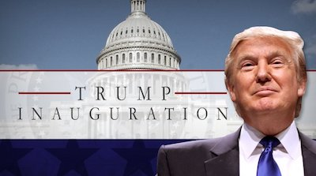

# Project 1: How did economic developments influence inaugural speeches?
### Doc folder



### [Project Description](doc/)
This is the first and only *individual* (as opposed to *team*) this semester. 

Term: Fall 2017

+ Projec title: How did economic developments influence inaugural speeches?
+ This project is conducted by [Yajie Guo]

+ Project summary: Economic conditions are vital for a country's development,that' why every president talks at length about them during their inaugural speeches.However,there may exist a couple of differences in aspects of their speeches between prosperous years and depression years.In this analysis,we'll see how economic development makes effects on presidents' inaugual speeches,and looked at the similarities and differences between Roosevelt and Obama,both of whom experienced depression,by text modeling,wordcloud and emotion analysis.

This folder is orgarnized as follows.

```
proj/
├── lib/
├── data/
├── doc/
├── figs/
└── output/
```

Please see each subfolder for a README file.
